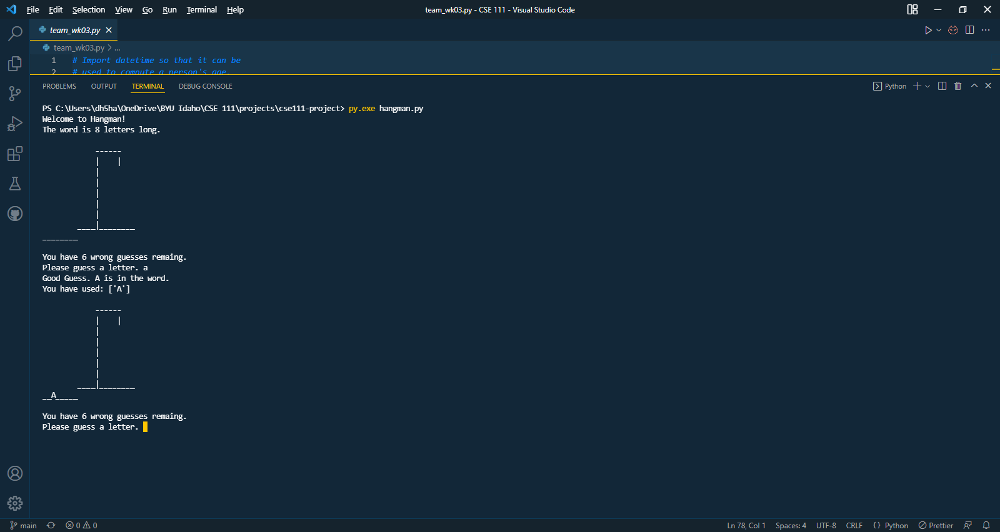

# cse111-project
Final project for CSE111 Programming with Functions class at BYU-Idaho 

# Hangman
This is a terminal based Python version of Hangman. This is a beginner project. 
Hangman is a simple word guessing game. Players have 6 chances or wrong guesses to solve 
the unknown word. With each wrong guess, part of the a person is drawn onto the gallows. 
The person is drawn in order, the head, body, left arm, right arm, left leg, right leg.

# Getting Started
Make sure that you have Python 3.8.0 or newer.

Open a terminal and browse to the project's root folder. Start the program by running the following command.
```

python3 hangman.py
or
py.exe hangman.py

```
You can also run the program from an IDE like Visual Studio Code. 
Start your IDE and open the hangman.py file and click the "run" icon.



Enjoy and have fun.
